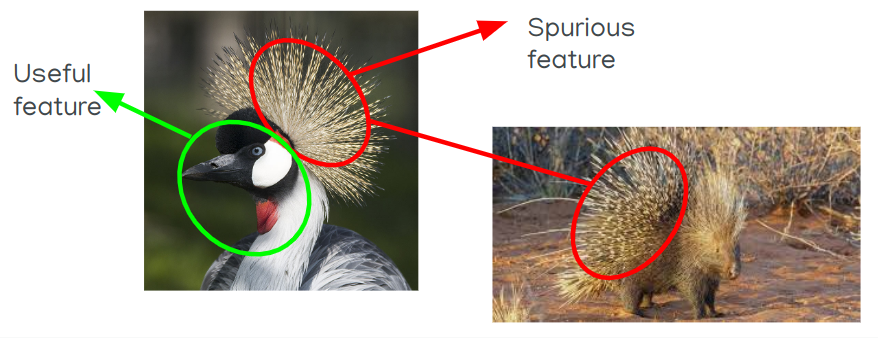

# CS337 Project - Disagreement Learning

Team SaNGiT

- Ashwin Goyal
- Aditya Nemiwal
- Atharva Abhijit Tambat
- Divyansh Singhal

## Overview

We demonstrated that using Disagreement Learning can improve the diversity of the various models trained and hence encourages better generalization for the ensemble. This also ensures that the model does not make costly mistakes when it is unsure and decreases the confidence on predicting images it isn't supposed to predict. Disagreement learning also helps counter simplicity bias

## Our Tasks

1. **Hypothesis 1** - We want to demonstrate that using the disagreement loss causes the model to learner harder features compared to just the cross-entropy loss. This makes the model more generalizable.
2. **Hypothesis 2** - We wish to analyse how the number of classes in a classification task affects the ability of the disagreement loss to improve upon standard ensembling and whether we can design a new loss function on the same principles to mitigate that effect.
3. **Hypothesis 3** - We wish to show that the accuracy improves with the number of models in the DBAT loss i.e. ensembling over more models, trained to disagree is better for accuracy.
4. We demostrated the results of the paper with smaller models and analysed how the results changed from what they reported

## How to run code
1. **Hypothesis 1** - Look at ``Domino/domino.ipynb``
2.**Hypothesis 2** - Look at ``num_classes_cifar/test_num_classes.ipynb`` for the old loss function and ``num_classes_cifar/test_num_classes_new_loss.ipynb`` for the new loss function. For extra runs with different random seeds, look at ``num_classes_cifar/runs`` for runs with old loss function and ``num_classes_cifar/runs_newloss`` for runs with the new loss function.
3. **Hypothesis 3** - To run on waterbird dataset, run ``waterbird_single_run/train-waterbird_4.sh`` or ``waterbird_single_run/train-waterbird_5.sh``. Note that these runs will access scripts from the src folder and their output will need to be piped to a file. The waterbird dataset will have to be separately installed and kept in the ``waterbird_single_run/datasets`` folder to run these. Checkout the ``waterbird_single_run/datasets`` to see how to download those.

To run on CIFAR, run ``num_ensembles_cifar/test_num_ensembles.ipynb``

4. Run ``office_home/train-office-home-ood_is_test.sh`` and ``office_home/train-office-home-ood_is_not_test.sh`` to run DBAT vs non-DBAT on Office-Home dataset.
Note that these runs will access scripts from the src folder and their output will need to be piped to a file. The dataset will have to be separately installed and kept in the ``office_home/datasets`` folder to run these. Checkout the ``office_home/datasets`` to see how to download those.

## Requirements

You will mostly need only the standard Machine Learning Packages, along with the wilds package(in case you plan to run the waterbird tests).

A requirements.txt has been provided, containing all of our versions.

## Code credits

Codes for domino are written by us and the new loss function is also designed by us.

The codes for ensemble size testing and number of classes have been taken from the official repository of Agree-to-Disagree but have undergone significant alteration.

Codes for waterbird and office-home are taken directly from the Agree-to-Disagree github repo and we have only changed the model to perform our testing.

## Presentation

[Presentation](https://docs.google.com/presentation/d/1Me-VbeTc64zNqFGPmz2Rw9wZ82AhXt5pix_1RYk4w5c/edit#slide=id.p)

## Report

[Report](https://drive.google.com/file/d/1IKykXetKJNLxlQ6dO-CNDUA_yFyJXtkv/view?usp=drivesdk)

## References

[Agree-to-Disagree - Original paper](https://openreview.net/pdf?id=K7CbYQbyYhY)

[Agree-to-Disagree-Github](https://github.com/mpagli/Agree-to-Disagree)
